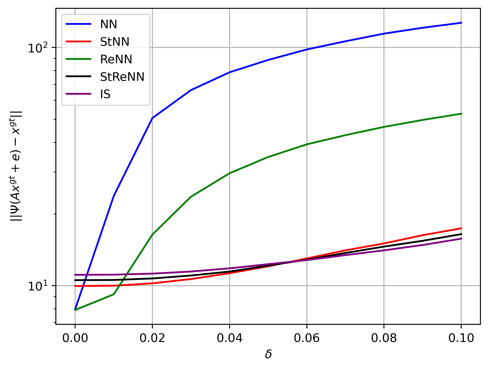
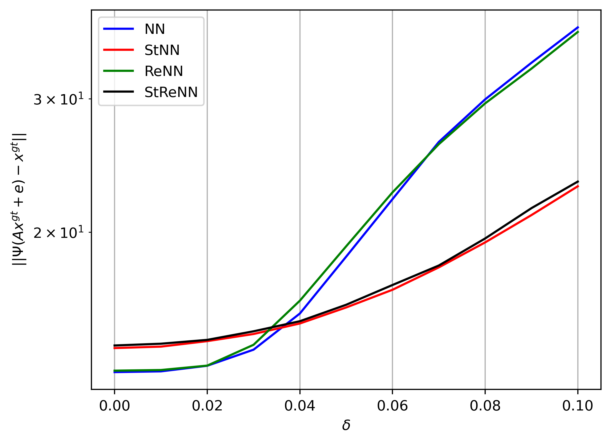
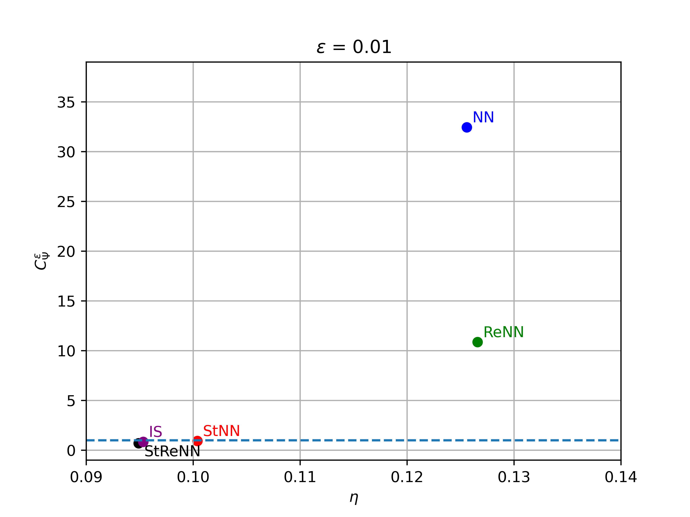
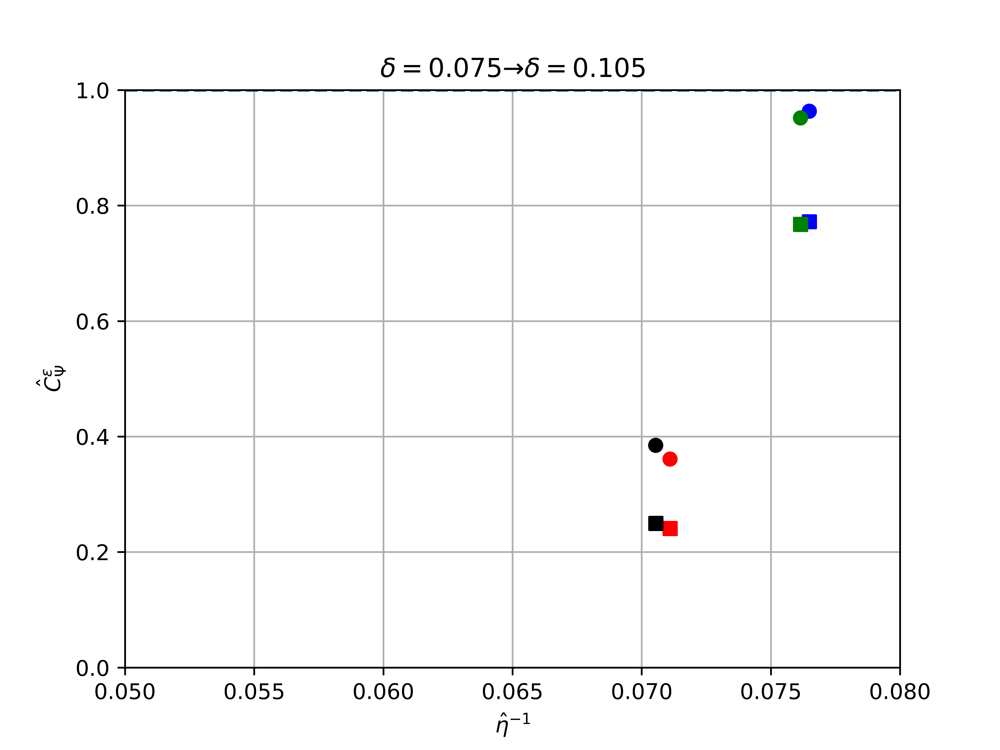

# Stabilized Regularized Neural Networks (StReNN)

GitHub repository to reproduce experiments from the paper: *To be or not to be stable, that is the question: understanding neural networks for inverse problems*. The paper is now a pre-print on arXiv. Please refer to https://arxiv.org/abs/2211.13692.

## Installation
The use the code, simply clone the GitHub repository locally with

```
git clone https://github.com/loibo/stabilize_neural_networks.git
```

Moreover, the `IPPy` library is required to execute portions of the code. `IPPy` contains utility functions to work with reconstructors. It can be accessed by cloning the `IPPy` repository locally, inside of the main folder of this project. To do that, simply move inside of the project directory and run

```
git clone https://github.com/devangelista2/IPPy.git
```

## Project Stucture
Please note that the functions requires a specific folders and files structure to work. Since, due to memory constraint, it was not possible to upload the whole project on GitHub, the user is asked to create some folders to follow the required structure. A diagram representing it is given in the following.

```
|- data
|   |- GOPRO_train_small.npy
|   |- GOPRO_test_small.npy
|- images
|   |- ...
|- IPPy
|   |- ...
|- model_weights
|   |- ...
|- plots
|   |- ...
|- statistics
|   |- ...
|- other_files.py
```

This can be obtained by simply creating the `data` and the `model_weights` folders by running:

```
mkdir data
mkdir model_weights
```

For informations about how to download the data (to be placed inside the `data` folder), and the pre-trained model weights, please refer to the following.

## Datasets
To run the experiments, the training and the test set has to be downloaded. A copy of the data used to train the models and get the results for the paper is available on HuggingFace. To get it, simply create a folder named `data` into the main project directory, move into that and run the following command:

```
git lfs install
git clone https://huggingface.co/datasets/TivoGatto/celeba_grayscale
```

which will download the data, in `.npy` format, used in the experiments. It is a slighly modified version of the GoPro dataset, where the images has been cropped to be $256 \times 256$ images, and converted to grey-scale with standard conversion algorithms. 

## Pre-trained models

The pre-trained models will be available soon.

## Usage
The most important files to take into considerations are:
* `train_models.py`: used to train the models;
* `estimate_accuracy_stability.py`: used to compute an approximation of the accuracy and the stability constant of each model;
* `compute_metrics_single_image.py`: used to generate visual results of a given input image and the corresponding metrics, expressed as **Relative Error**, **PSNR** and **SSIM**.

In the following, we will report the usage for each of those main files.

### **train_models.py**
As already mentioned, this is used to train the models if you don't want (or you don't have access to) the pre-trained model weights. There are 4 possible models you can train: `nn`, `renn`, `stnn` and `strenn`. Given a configuration file (in `.yml` format) with the same structure of the configuration files you can find in the `config/` folder and given a float number representing the amount of *noise injection* you want to use in your training, run:

```
python train_models.py -m MODEL -ni NOISE_INJECTION --config CONFIG_PATH
```

After the training is completed. The resulting weights will appear in the `model_weights` folder.

### **estimate_accuracy_stability.py**
Given the model in the list `nn`, `renn`, `stnn`, `strenn`, given the noise injection floating point number, the configuration file as above and a floating point number `epsilon` representing the additional corruption (it is summed with the noise injection), to obtain an estimation of the accuracy of the considered model and its stability constant, run:

```
python estimate_accuracy_stability.py -m MODEL1 -m MODEL2 -m MODEL3 -m MODEL4 -ni NOISE_INJECTION -e EPSILON --config CONFIG_PATH
```

Note that multiple models can be tested at the same time.

### **compute_metrics_single_image.py**
Given the same parameters described above, to compute the metrics (and generate the results) for an image in a fixed PATH, run:

```
python compute_metrics_single_image.py -p PATH -m MODEL1 -m MODEL2 -m MODEL3 -m MODEL4 -ni NOISE_INJECTION -e EPSILON --config CONFIG_PATH
```

## Results


| $\hat{\delta}=0$             |  $\hat{\delta}=0.025$ |
:-------------------------:|:-------------------------:
 | 
 | 

## BibTex citation
Consider citing our work if you use it. Here the Bibtex for the citation.

```
@article{evangelista2022or,
  title={To be or not to be stable, that is the question: understanding neural networks for inverse problems},
  author={Evangelista, Davide and Nagy, James and Morotti, Elena and Piccolomini, Elena Loli},
  journal={arXiv preprint arXiv:2211.13692},
  year={2022}
}
```